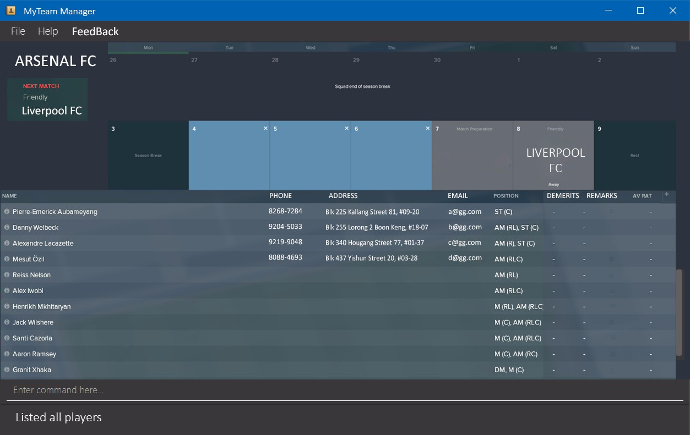
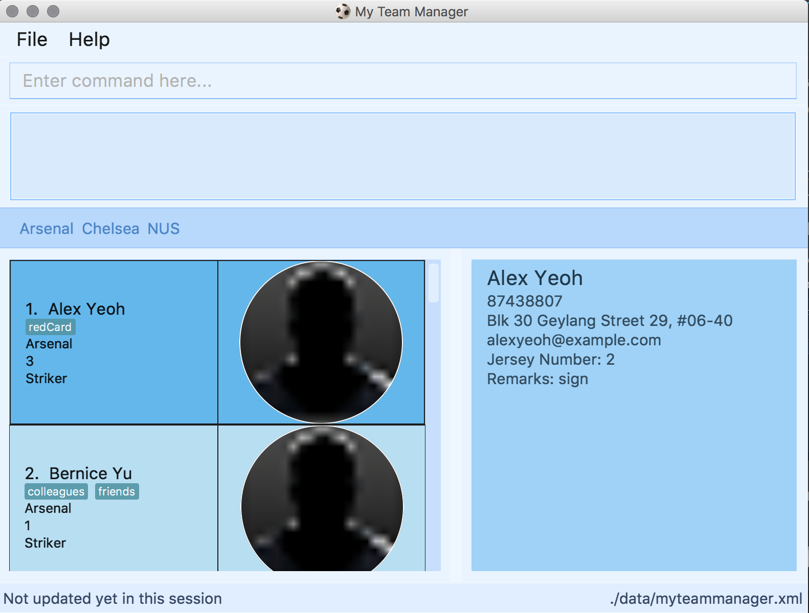

= My Team Manager
ifdef::env-github,env-browser[:relfileprefix: docs/]

https://travis-ci.org/CS2103JAN2018-F14-B1/main[image:https://travis-ci.org/CS2103JAN2018-F14-B1/main.svg?branch=master[Build Status]]
https://ci.appveyor.com/project/lithiumlkid/main/branch/master[image:https://ci.appveyor.com/api/projects/status/2itvfqp2b8xnaqqn/branch/master?svg=true[Build status]]
https://coveralls.io/github/CS2103JAN2018-F14-B1/main?branch=master[image:https://coveralls.io/repos/github/CS2103JAN2018-F14-B1/main/badge.svg?branch=master[Coverage Status]]
https://gitter.im/se-edu/Lobby[image:https://badges.gitter.im/se-edu/Lobby.svg[Gitter chat]]

ifdef::env-github[]

endif::[]

ifndef::env-github[]
image::images/MyTeamManagerLogo.png[width="600", align="center"]
endif::[]

ifdef::env-github[]

endif::[]

ifndef::env-github[]

endif::[]

== Introduction to MTM
My Team Manager (MTM) is a desktop based team managing application for football team managers. +
It uses a Command Line Interface (CLI).

MTM is equipped with multiple features in helping you efficiently
and effectively manage your players, while keeping track of the team's schedule. +

With MTM's aesthetically pleasing graphical user interface, viewing critical information will be quick and painless.
Never lose track of your training schedule again! +

Say goodbye to manual tracking of information on excel sheet after excel sheet!

== What MTM Can Do - Key Features

* Set up Teams
* Add Players to Teams
* Add Player's personal details, position, season statistics, demerits, etc.
* View, Edit and Delete Players
* Sort players by field of choice
* Manage Schedule of Teams

Come and take a look at our link:./UserGuide.adoc[User Guide] to get started with MTM now.

== Site Map

* <<UserGuide#, User Guide>>
* <<DeveloperGuide#, Developer Guide>>
* <<AboutUs#, About Us>>
* <<ContactUs#, Contact Us>>

== Acknowledgements

* Some parts of this sample application were inspired by the excellent http://code.makery.ch/library/javafx-8-tutorial/[Java FX tutorial] by
_Marco Jakob_.
* Libraries used: https://github.com/TomasMikula/EasyBind[EasyBind], https://github.com/TestFX/TestFX[TextFX], https://bitbucket.org/controlsfx/controlsfx/[ControlsFX], https://github.com/FasterXML/jackson[Jackson], https://github.com/google/guava[Guava], https://github.com/junit-team/junit4[JUnit4]
* Logo created on http://logomakr.com[LogoMakr]: https://logomakr.com/22Mc9C[My Team Manager Logo]

== Licence : link:LICENSE[MIT]
